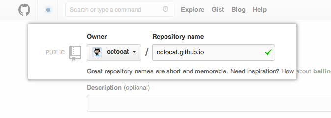
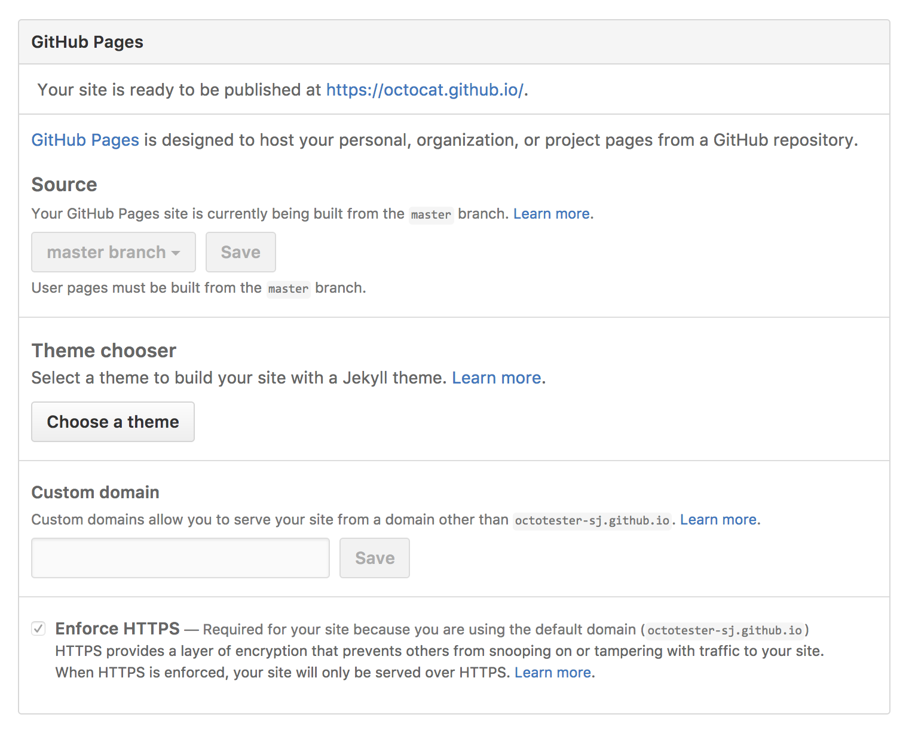
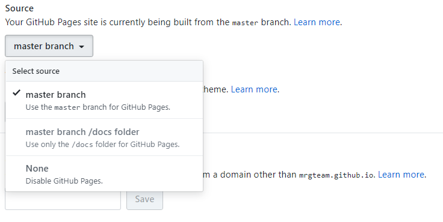

Prepare GIT repository
======================

Create the `main`  GitHub repository 
------------------------------------

First of all, on the new repository screen, you need to create a repository with a special name to generate your website. 

Your website’s files will live in a repository named `username.github.io` (where “username” is your actual GitHub user name). 
To begin setting up your site, you have to open the \ **Settings tab**\ . You'll see the \ **GitHub Pages section**\  near the bottom. 
Click the \ **choose a theme**\  button to start the process of creating your site. Then choose a theme from the list. 

Thereafter, your website will be accessible at \ **https://username.github.io**\  

For now we dont want to use GitHub pages in this way. So we'll leave the \ **main**\  repository out and come back to it later.

.. note:: 

   If you really want to test your website, you can push an `index.html` file at the `root` of the `master` branch and go to you website url (\ **https://username.github.io**\ )

Organize your documentation repository
--------------------------------------

Here, what we will do, is to create another repository that will be a child of the "main" repository.
The objective is to have a repository by written documentation.

For example, imagine that we want to write a documentation on `python` and another on `ruby`. 
The documents will be respectively accessible at \ **https://username.github.io/python** \  and \ **https://username.github.io/ruby** \.

.. note::

   We therefore respect the following structure : \ **https://username.github.io/documentation-repository** \ 

To respect this structure, we gonna create a new repository named `get-started-with-sphinx`.

Next, as the same as the `main` repository, you have to open the \ **Settings tab**\  and scroll down to \ **GitHub Pages section**\.
Click on the \ **source**\  dropdown list and choose \ **master branch**\.

Your repository is now ready to host your Sphinx documentation ! 

.. note:: 

   If you really want to test your website, you can push an `index.html` file at the `root` of the `master` branch and go to you website url (\ **https://username.github.io/get-started-with-sphinx**\ )